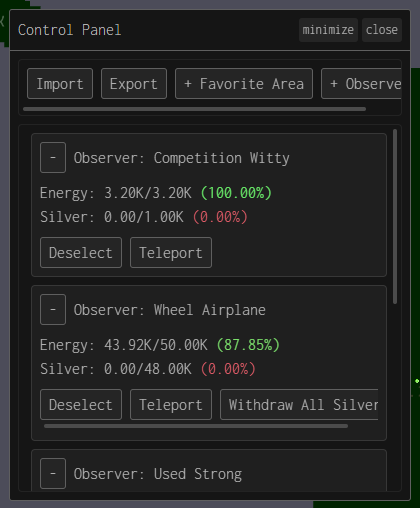
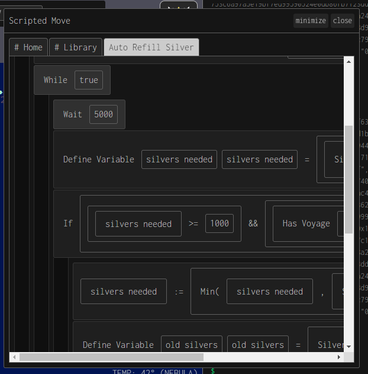
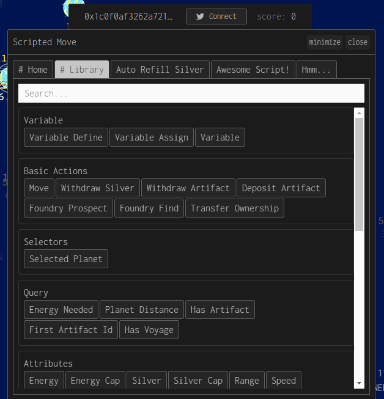

# nahkd's Dark Forest plugins repository (sort of...)
Welcome to my plugins repository!

## Using my plugins
Currently I'm using ``df-plugin-dev-server`` for plugins development, but you can also use imports flattener and put it directly to your plugins list.

## Plugins
### Control Panel
Remotely control your planets. Including Withdraw Silvers and Foundry Prospect + Find



```js
export { default } from "http://localhost:2222/control-panel.js?dev";
```

> Tip: Hold Shift while scrolling with scroll wheel to scroll horizontally

### Scripted Move
Scratch for Dark Forest. For real automation, you should make a plugin.



```js
export { default } from "http://localhost:2222/scripted-move.js?dev";
```

The ``# Library`` tab contains all available blocks for you to use. Simply drag and drop it to ``+ Drop Statement Block Here`` or text box inside statement block. If there are too many blocks, you can use the search filter. While dragging, you can put your pointer on the tab name to switch to it:



### Other plugins
_More comming soon..._

## Warning
Plugins can access to your game private informations (such as private key or planets coordinates). Only trust plugins that you've made or someone you trust. Code that's loaded from different origin (unpkg for example) may have it's code swapped and can steal private informations as well.
